# Cette application est en cours de développement depuis le 01/04/2023 par Alexey Zhukov. 
Les fichiers de cette application peuvent être transférés ou modifiés en fonction des besoins du client. 
Pour vérifier si l'application pour "PFE" fonctionne, veuillez vous référer au tag : "PFE version 1.0".

# Application d'évaluation visuelle des cartes d'explication sur des images

## 1. Description

La mise en place de ce projet se base sur un travail de l’axe IA du LaBRi concernant l’explication des décisions des réseaux profonds en classification d’images.
L’objectif de ce projet est de développer une application pour une expérience participative d’évaluation des cartes d’explication par des sujets humains.
Ainsi, grâce à l’application mise en place, un utilisateur peut participer à une expérience d’évaluation pour soumettre son avis sur les cartes d'explications des décisions des réseaux de neurones profonds. Ces résultats sont par la suite récoltés pour de plus amples analyses sur l'interprétation de sujets humains sur l'efficacité du réseau de neurones.

L'implémentation de ce projet se base principalement sur l'utilisation du service de base de données `MySQL` et le simulateur de serveur local `XAMPP`.

## 2. Installations

### 2.1. Environnement Xampp

Pour mettre en place ce projet, nous choisissons d’utiliser l'environnement de développement XAMPP. Cet outil nous permet alors de simuler un serveur local pour tester le développement de notre outil.

Pour l’installation de XAMPP, voici le lien de téléchargement :
```
https://www.apachefriends.org/fr/index.html
```
Lors de l'installation, il faut vérifier que toutes les composantes à installer sont bien cochées.
Une fois l'installation effectuée, il faut se placer dans le dossier créé par l'installation, puis se placer dans le dossier htdocs selon l'environnement :

#### Si vous êtes sur Windows :

```
$ cd xampp
$ cd htdocs
```
#### Si vous êtes sur une distribution Linux :
```
$ cd opt
$ cd lampp
$ cd htdocs
```
#### Si vous êtes sur Mac OS :
```
$ cd xamppfiles
$ cd htdocs
```

Dans ce dossier, vous pouvez alors cloner le dépôt de notre projet, en SSH ou en HTTPS, disponible sur gitlab :
```
$ git clone git@gitlab.emi.u-bordeaux.fr:azhukov/pfe.git
```
ou
```
$ git clone https://gitlab.emi.u-bordeaux.fr/azhukov/pfe.git
```
#### 2.1.1 Paramètres supplémentaires :
Les paramètres d'Apache et de MySQL doivent être modifiés pour fonctionner correctement.
1) Apache (dossier `apache/conf/`): Dans le fichier `httpd.conf`, changez le DocumentRoot par défaut (.../htdocs) par `.../htdocs/pfe/site`, et changez le Directory (.../htdocs) par `.../htdocs/pfe/site`.
2) MySql (dossier `mysql/backup/`): Dans le fichier `my.ini`, ajouter, si manquant : `event_scheduler=ON` sous `[mysqld]`.
3) Si vous êtes sur Linux la 2ème étape est différente. Dans le dossier /opt/lampp/etc/, il faut modifier le fichier `my.cnf` et ajouter la ligne `event_scheduler=ON` sous `[mysqld]`.

#### 2.1.2 Lancer Xampp :

#### Si vous êtes sur Windows :

Vous devez ouvrir le panneau de contrôle de Xampp (`Xampp/xampp-control`) et activer les deux boutons liés à `Apache` et `MySQL` :
<figure>
    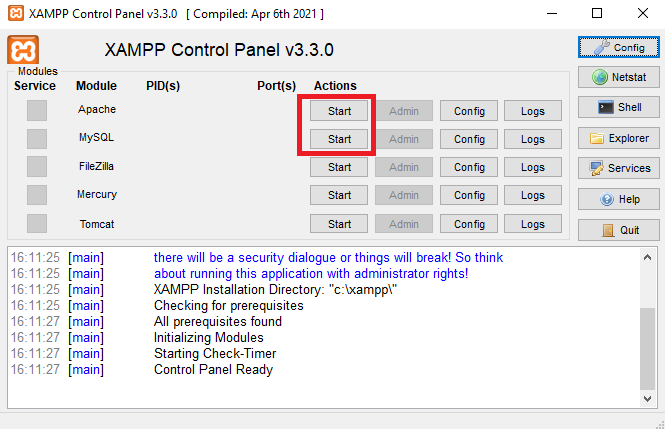
  <figcaption><b>Activation d'Apache et MySQL depuis le panneau de contrôle Xampp</b></figcaption>
</figure>

Les deux modules doivent alors apparaître sur fond vert et le terminal indique qu'ils sont démarrés et en cours d'exécution.

#### Si vous êtes sur une distribution Linux :

Vous devez ouvrir le terminal et taper la commande suivante :
```
$ sudo /opt/lampp/./manager-linux-x64.run
```
**Remarque:**

Si l'url de l'application ne fonctionne pas, il faut modifier le port de MySQL DataBase en mettant 3307 au lieu 3306, et celui de Apache (81 au lieu de 80) en cliquant sur le bouton Configure pour les deux.

#### 2.1.3 Lancement de l'application :

Enfin, vous pouvez ouvrir un navigateur pour coller et accéder à l'url suivant de notre application :
```
http://localhost/
```
**Remarque:**

Si ça ne fonctionne pas mettez:

```
http://localhost:81/
```

### 2.2. (Optionnel) Configuration de phpMyAdmin
Il y a deux fichiers sql dans le dossier `init-files`.
```
1. replace_user_data.sql
2. utilisateurs.sql
```
1) Le premier fichier créera un événement pour nettoyer les données personnelles des utilisateurs après 6 mois à compter de la date d'enregistrement de l'utilisateur.
2) Le deuxième fichier est un squelette vide du tableau nécessaire à l'expérience.

Chacun de ces fichiers contient du code SQL qui doit être saisi dans la console SQL de `phpMyAdmin`.
Cliquez ensuite sur `Exécuter`.
<figure>
    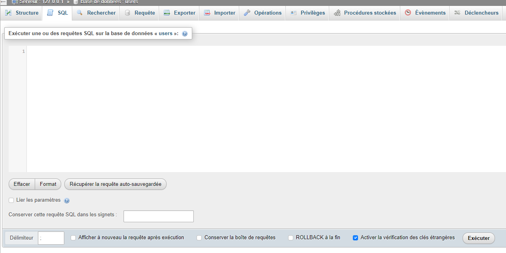
  <figcaption><b>Console SQL dans phpMyAdmin.</b></figcaption>
</figure>

#### Option alternative
Il est possible d'utiliser une base de données sur un serveur tiers plutôt qu'une base locale.
Pour ce faire, il suffit de modifier légèrement le code dans `sql-data-access.php`

```
    $host = "yourdatabase.com:3306";
    $username = "yourname";
    $password = "yourpass";
    $dbname = "yourdataname";
```

Toutefois, dans le cas d'un serveur tiers ou d'autres configurations de serveurs locaux,
`sql-data-access.php` et la `replace_user_data.sql` doivent être modifiées.

Il existe une option sur `sql-data-access.php` avec un compte gratuit spécialement créé sur un serveur tiers.

Lien : https://www.phpmyadmin.co/

### 2.3. Tests unitaires

Pour effectuer les tests unitaires, nous utilisons le framework de test appelé __Jest__. Les étapes à suivre pour l'installation sont toutes à effectuer depuis le dossier `pfe/tests/` :
```
$ cd tests
```
* création du fichier `package.json`
```
npm init -y
```
Une fois le fichier créé, vous devez le modifier comme ceci :
```json
{
  "name": "tests",
  "version": "1.0.0",
  "description": "",
  "main": "script.test.js",
  "scripts": {
    "test": "jest"
  },
  "jest": {
    "testEnvironment": "node",
    "projects": [
      {
        "displayName": "admin",
        "testEnvironment": "jest-environment-jsdom",
        "testMatch": [
          "<rootDir>/admin.test.js"
        ]
      },
      {
        "displayName": "other",
        "testEnvironment": "node",
        "testMatch": [
          "<rootDir>/csv_data.test.js",
          "<rootDir>/database.test.js",
          "<rootDir>/script.test.js"
        ]
      }
    ]
  },
  "keywords": [],
  "author": "",
  "license": "ISC"
}
```

Puis installer différentes dépendances :
* installation de Fast-Text-Encoding
```
npm install --save-dev fast-text-encoding
```
* installation de Jest
```
npm install --save-dev jest
```
* installation de Jest-Environment-Jsdom
```
npm install --save-dev jest-environment-jsdom
```
* reconnaissance de l'appel à la propriété `localStorage` utilisée dans le code :
```
npm install --save-dev node-localstorage
```
* installation de Text-Encoding
```
npm install --save-dev text-encoding
```
* installation de Jquery
```
npm install --save-dev jquery
```
* installation de MySQL
```
npm install --save-dev mysql
```
* installation de Papaparse
```
npm install --save-dev papaparse
```
Une fois l'installation effectuée, il suffit d'exécuter les tests avec la commande suivante :
```
npm run test
```


## 3. Utilisation de l'outil

L'interface de l'outil est a été testée sur Google Chrome (111.0.5563.64 (Build officiel) (64 bits)), Mozilla Firefox (110.0.1 (64 bits)).

**Remarque:**

Il est important de vérifier que les dossiers site/back/data/users/mix_data, save_users et session_users ont la permission de lecture et d'écriture.

### 3.1. Inscription

Une fois que vous avez accédé à l'url `http://localhost` dans votre navigateur, vous avez accès à la première page de l'outil.

<figure>
    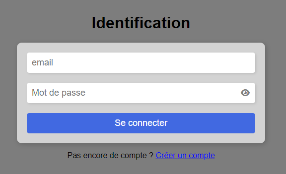
  <figcaption><b>Écran de connexion à l'expérience</b></figcaption>
</figure>

Cette première page est une page d'identification lorsque vous avez déjà créé un compte. Dans un premier temps, vous devez donc en créer un et, pour ce faire, cliquer sur le lien `Créer un compte`.

<figure>
    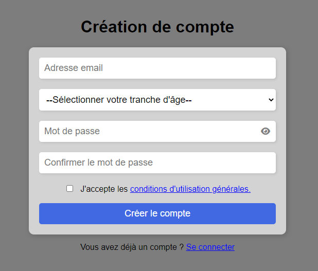
  <figcaption><b>Écran de création de compte</b></figcaption>
</figure>

Vous observez alors la page ci-dessus et devez remplir chacun des champs du formulaire pour créer un compte. 
Par ailleurs, il est important de cocher la case pour accepter les conditions d'utilisation générales, document accessible grâce au lien cliquable du même nom, sans quoi le compte ne pourra être créé. Si une erreur a été commise lors du remplissage des champs, un message sera affiché, dans le cas contraire, vous serez redirigé vers la page de connexion.

### 3.2. Connexion et consignes

Après cette étape, vous pouvez alors vous connecter librement à l’expérience à tout moment en indiquant votre adresse mail et le mot de passe créé précédemment.

Une fois connecté, la première page que vous pouvez visualiser concerne les consignes relatives au bon déroulement de l'expérience. Elle mentionne également la conservation des données personnelles entrées lors de l'inscription à l'outil.

<figure>
    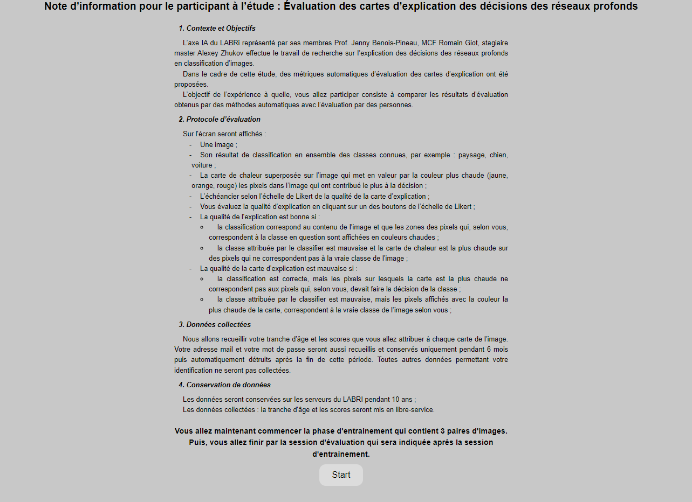
  <figcaption><b>Écran des consignes de l'expérience</b></figcaption>
</figure>

### 3.3. Expérience

Après avoir lu cette description, vous pouvez maintenant lancer une session en cliquant sur le bouton `start`. Une session consiste en l'apparition de :
* une image d'origine
* une sup image (une image d'origine avec sa carte d'explication)
* la vérité terrain
* la classification
* une liste de boutons pour que vous puissiez évaluer les images

<figure>
    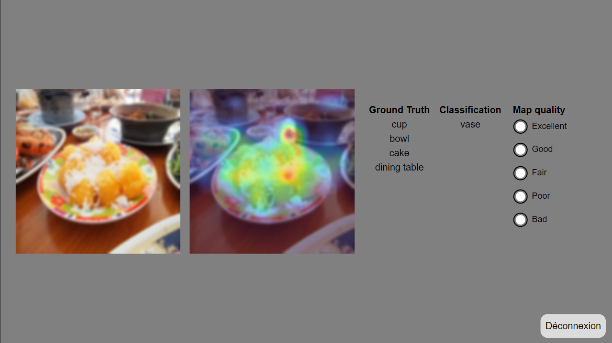
  <figcaption><b>Écran de l'expérience</b></figcaption>
</figure>

Chaque choix doit être effectué dans un temps imparti de 20 secondes, chaque évaluation étant séparée par un écran neutre de 5 secondes.
Une session se compose alors de la manière suivante, en deux étapes :
* la phase d'entraînement : les 3 premières images sont considérées comme des images d’entraînement. En effet, lors de cette phase, vos choix ne seront pas pris en compte.
* la phase d'évaluation : durant cette phase, constituée de 240 images, chacun de vos choix, avec chaque temps pris pour faire chaque choix, seront pris en compte et enregistrés ultérieurement. Pour la dernière session, il ne vous restera que 120 images.

Vous pouvez commencer la phase d'évaluation dès que vous le souhaitez en appuyant sur le bouton `start`.
<figure>
    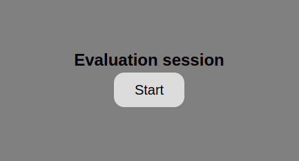
  <figcaption><b>Écran pour lancement de la phase d'évaluation</b></figcaption>
</figure>

### 3.4. Déconnexion

Durant la totalité de votre session, vous pouvez tout à fait vous déconnecter de l’expérience en utilisant le bouton situé en bas à droite de l'écran, disponible durant les évaluations. Dans ce cas, vous serez redirigé vers l'écran de connexion et, lors de votre prochaine connexion, vous pourrez reprendre votre session là où vous l’aviez arrêté.

Dans le cas où vous avez fini une session, vous pouvez démarrer une toute nouvelle session, et ainsi revenir sur la page des consignes, ou alors simplement vous déconnecter de l’outil, et être redirigé sur la page de connexion.

<figure>
    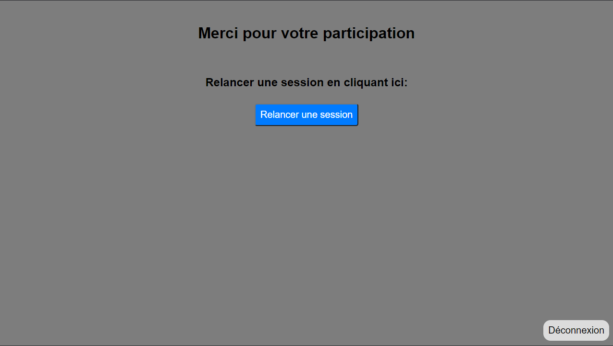
  <figcaption><b>Écran de fin de session</b></figcaption>
</figure>


### 3.5. Fin d'expérience

Vous aurez fini l'expérience lorsque vous aurez effectué les 8 sessions, c'est-à-dire évalué les 1800 images à votre disposition. Dans ce cas, l'écran vous le notifie à la fin de votre dernière session.

<figure>
    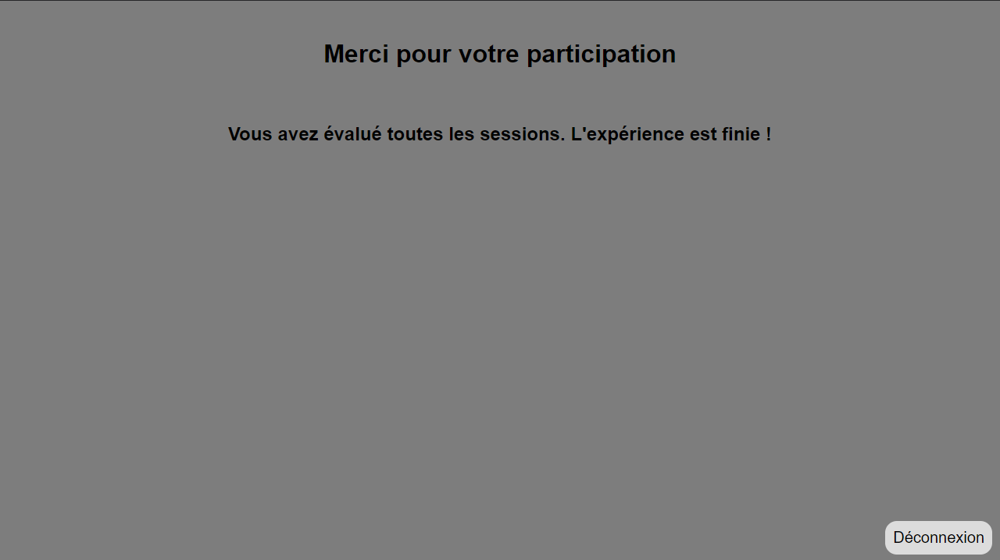
  <figcaption><b>Écran de fin d'expérience</b></figcaption>
</figure>

Vous pouvez alors vous déconnecter en utilisant le bouton situé en bas en droite de votre écran.

### 3.6. Page administrateur

Pour pouvoir accéder à la page administrateur de l'application, il faut vous connecter avec une certaine adresse mail et un certain mot de passe, affichés ci-dessous :
<figure>
    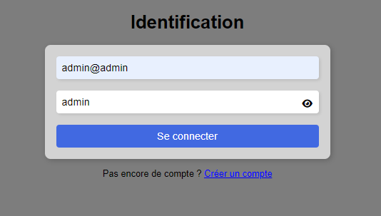
    <figcaption><b>Identifiants connexion administrateur</b></figcaption>
</figure>

Une fois connecté, vous avez accès à la page suivante :
<figure>
    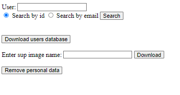
    <figcaption><b>Page administrateur</b></figcaption>
</figure>

Une fois sur cette page, vous avez accès à différentes actions :
* Afficher les informations d'un utilisateur en indiquant son identifiant (exemple : `404`) ou bien son adresse mail. Attention à bien sélectionner le type de votre recherche sous le texte d'entrée `User`, avant d'appuyer sur le bouton `Search`.
Vous pouvez alors visualiser les informations d'un utilisateur sur écran comme ceci :
<figure>
    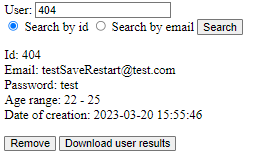
    <figcaption><b>Informations sur un utilisateur</b></figcaption>
</figure>

À partir de là, vous pouvez supprimer l'utilisateur de la base de données grâce au bouton `Remove`, et toutes les évaluations qu'il a effectué, ou bien télécharger les résultats des évaluations de cet utilisateur, directement sur votre ordinateur dans un fichier au format CSV, grâce au bouton `Download user results`.
* Télécharger la base de données avec le bouton `Download users database`,  c'est-à-dire visualiser les informations de tous les utilisateurs ayant créé un compte. Ces informations sont contenues dans un fichier CSV chargé sur votre ordinateur.
* Télécharger les évaluations des utilisateurs concernant une seule image. Pour cela, il suffit d'indiquer le nom d'une image du dossier `sup` dans le champ `Enter sup image name` (par exemple : `COCO_train2014_000000001510_noise-k-25-0_FEM_sup.jpg`). Cette opération est possible seulement si l'image a été évaluée au moins une fois par au moins un utilisateur. Dans ce cas, et comme précédemment, un fichier CSV sera télécharger sur votre ordinateur.
* Supprimer les informations des différents comptes utilisateurs inscrits dans la base de données. En effet, il est possible d'anonymiser les données personnelles des utilisateurs, en particulier l'adresse mail et le mot de passe, en cliquant sur le bouton `Remove personnal data`.


## 4. Contributeurs

Ce projet a été réalisé par une équipe de 4 étudiants en Master 2 Informatique, spécialité Image et Son, dans le cadre du projet de fin d'études :
ZHUKOV Alexey, EL KERZAZI Mohammed-Amine, BEDOURET Baptiste et REBIERE-POUYADE Lilian.

